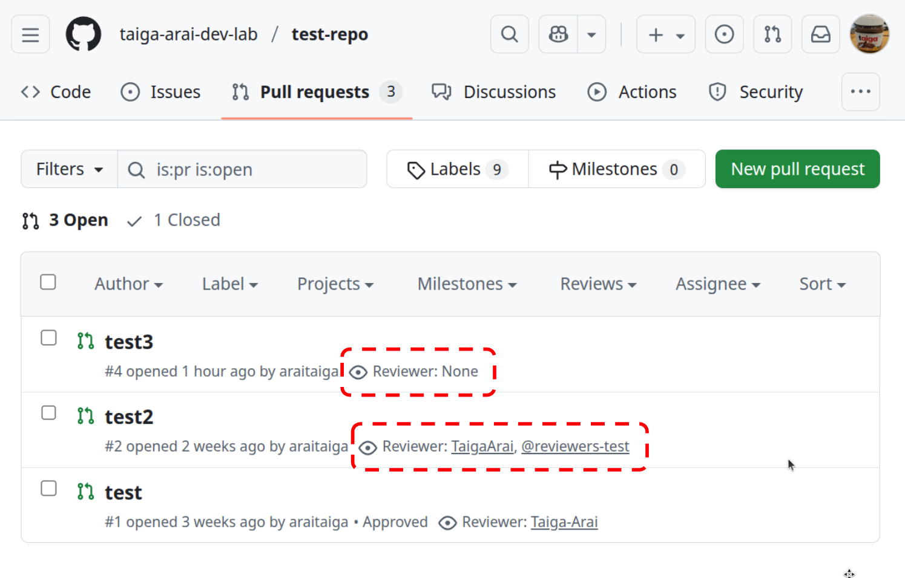
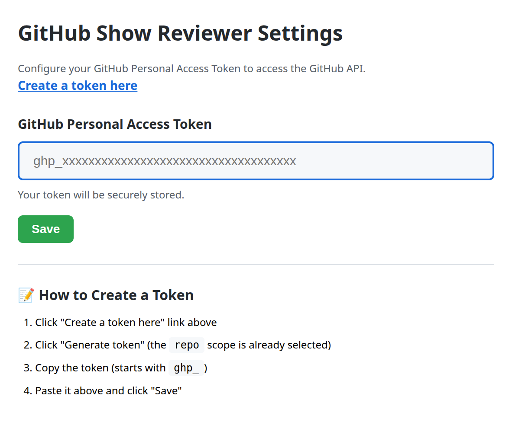

# GitHub PR Enchancer

A Chrome extension that displays reviewers directly in the GitHub Pull Request list view.

[Chrome Web Store / github-show-reviewer](https://chromewebstore.google.com/detail/github-show-reviewer/oiooodcehfplbgnamghfcnklebcdohhd?authuser=0&hl=en)

## Features

- Display reviewer names
  - Supports team reviewers
  - Shows users who have already reviewed
  - Displays "None" when no reviewers are assigned
- Click on a reviewer/team reviewer to filter PRs by that assignee

## Installation

**Chrome Web Store:**  
[Chrome Web Store / github-show-reviewer](https://chromewebstore.google.com/detail/github-show-reviewer/oiooodcehfplbgnamghfcnklebcdohhd?authuser=0&hl=en)

**For Developers:**

1. Clone this repository
2. Open Chrome and navigate to `chrome://extensions`
3. Enable "Developer mode" in the top right corner
4. Click "Load unpacked" and select the extension directory

## Configuration

For private repositories or to increase API rate limits, you need to configure your GitHub Personal Access Token.

1. Open Chrome and navigate to `chrome://extensions`
2. Find "GitHub Show Reviewer" and click "Details"
3. Click "Extension options"
4. The GitHub Show Reviewer Settings page will open as shown below

5. Click "Create a token here" link
6. GitHub's fine-grained token creation page will open
7. Give the token a name, select the repositories it will be used on, and under Permissions set `Pull requests` to `Read`
8. Generate the token and copy it
9. Paste the token in the input field and click "Save"
