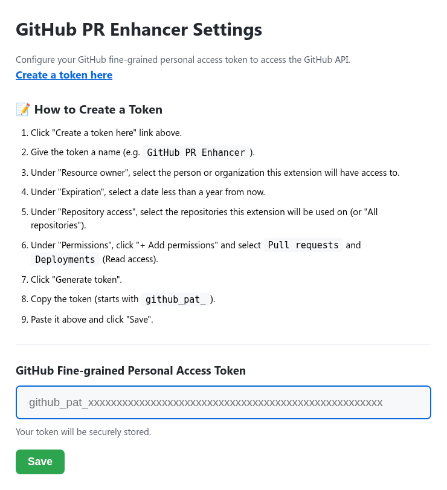

# GitHub PR Enchancer

A Chromium extension that displays reviewers directly in the GitHub PR page, and allows filtering of the current page.

## Features

- Reviewer filter bar
    - Shows all reviewers on the current page who haven't requested changes on, or approved a, PR
    - Clicking on an avatar will filter the current page to only show work pending for that person
- Reviewer avatars on individual PRs
    - Shows status of review (pending, requested changes, approved)
        - Green full circle border: Reviewer has approved PR
        - Yellow dashed circle border: Reviewer has requested changes on PR
        - No border: Reviewer hasn't looked at PR, or has only commented
    - Displays "None" when no reviewers are assigned
    - Supports "Team" reviewers
- Deployment status pills
    - List the environments a PR has been or is currently deployed to
        - Green: The PR is currently deployed to this environment
        - Yellow pulsing: The PR is being deployed to this environment
        - Gray: The PR was deployed to this environment at some point, but has been superseded by a different branch
    - Hovering over a pill will show additional info depending on context, e.g. deployment at, superseded on, etc

## Installation

1. Clone this repository.
2. Open Chrome and navigate to `chrome://extensions`.
3. Enable "Developer mode" in the top right corner.
4. Click "Load unpacked" and select the extension directory.

## Configuration

For private repositories or to increase API rate limits, you need to configure your GitHub Personal Access Token.

1. Open Chrome and navigate to `chrome://extensions`.
2. Find "GitHub Show Reviewer" and click "Details".
3. Click "Extension options".
4. The GitHub Show Reviewer Settings page will open as shown below.
   
5. Click "Create a token here" link.
6. GitHub's fine-grained token creation page will open.
7. Give the token a name, select the repos it will be used on, and under Permissions set `Pull requests` to `Read`.
8. Generate the token and copy it.
9. Paste the token in the input field and click "Save".
